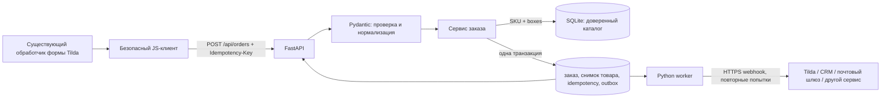

# ADROSTA Backend — Stage 01

Production-oriented backend формы оптового заказа ADROSTA на **Python 3.12, FastAPI и SQLite**. Проект продолжает исходный FastAPI-skeleton из приложенного архива: второй backend и другой технологический стек не создавались.

Каталог не хранится в JSON-файлах. Товары добавляются Python-командой в SQLite. Браузер технически передаёт тело HTTP-запроса в формате JSON, потому что это стандартный формат FastAPI, но вручную создавать или редактировать `.json` не требуется: для проверки запроса есть Swagger, а для Tilda — готовый клиент в `examples/tilda-api-client.js`.

## Аудит исходного архива

В `adrosta_backend_stage_01.zip` было ровно семь файлов:

- `app/main.py`, `app/__init__.py`, `app/routers/health.py`, `app/routers/__init__.py`;
- `requirements.txt`, `README.md`, `.gitignore`.

Исходный код был настоящим, но минимальным backend-skeleton: FastAPI-приложение версии `0.1.0`, `GET /`, `GET /health` и единственная зависимость FastAPI. Эти два маршрута работали и были сохранены совместимыми.

В архиве не было:

- HTML, CSS или JavaScript формы и кода скрытой нативной формы Tilda;
- запросов к API и маршрута создания заказа;
- моделей покупателя, компании, доставки и товаров;
- доверенного каталога, расчёта веса/объёма и постоянного хранилища;
- защиты от дублей, ограничения частоты, CORS и безопасного логирования;
- интеграции с Tilda, CRM, почтой или другим получателем;
- `.env.example`, использования переменных окружения, Docker-конфигурации;
- тестов и CI;
- каталога `.git`, поэтому история Git, ветки и коммиты в переданном архиве недоступны.

В исходных Python-файлах не было TODO или комментариев, описывающих будущий контракт. README содержал только команды установки и запуска. Поэтому неизвестные домены, SKU, характеристики товаров, CRM и хостинг не были выдуманы и по-прежнему требуют реальной настройки.

## Текущая архитектура

Приложение остаётся компактным монолитом FastAPI с одной SQLite-базой:



Основные части:

| Файл | Назначение |
|---|---|
| `app/main.py` | Создание FastAPI-приложения, middleware, CORS, trusted hosts, маршруты |
| `app/config.py` | Типизированная загрузка и проверка env, строгие production-ограничения |
| `app/schemas.py` | Строгий публичный контракт заказа, телефон/email и условные поля |
| `app/routers/orders.py` | `POST /api/orders` |
| `app/routers/health.py` | Liveness `GET /health` и readiness `GET /ready` |
| `app/database.py` | Схема SQLite, WAL, foreign keys и транзакции |
| `app/repositories.py` | Каталог, заказ, снимки характеристик, дедупликация, rate limit, outbox |
| `app/domain.py` | Чистые правила доверенных характеристик и расчёта груза |
| `app/services.py` | Оркестрация заказа и фоновой доставки |
| `app/container.py` | Сборка зависимостей приложения и worker |
| `app/integrations.py` | Универсальный server-to-server webhook без предположений о CRM |
| `app/security.py` | HMAC-отпечатки, проверка idempotency key, доверенные proxy IP |
| `app/errors.py` | Единый безопасный формат ошибок без отражения введённых данных |
| `app/observability.py` | Request ID, метаданные запросов и ограничение размера тела без логирования PII |
| `app/cli.py` | Управление SQLite-каталогом Python-командами, без JSON-файлов |
| `app/worker.py` | Доставка outbox-сообщений во внешний webhook |
| `examples/tilda-api-client.js` | Изолированный клиент для подключения к существующему Tilda handler |
| `tests/` | Маршрутные, валидационные и инфраструктурные тесты |
| `Dockerfile` | Один непривилегированный API-процесс Uvicorn |

### Что уже реализовано

- строгая проверка структуры и типов, неизвестные поля запрещены;
- нормализация российского телефона `8XXXXXXXXXX` или `7XXXXXXXXXX` в `+7XXXXXXXXXX` и проверка email;
- обязательная компания только для `buyer.type = legal`;
- ровно один пункт назначения: `pickupPoint` или `address`;
- приём от клиента только `sku` и `boxes` для каждой позиции;
- точный, регистрозависимый поиск активного SKU в SQLite;
- серверный пересчёт веса, объёма и габаритов из доверенного каталога;
- атомарное сохранение заказа и снимка характеристик товара на момент заказа;
- обязательный `Idempotency-Key`, повтор ответа на безопасный retry и защита от похожего повторного заказа;
- SQLite rate limit по HMAC-отпечатку IP;
- точный список CORS origins, trusted hosts и ограниченный размер запроса;
- логи только с метаданными и request ID, без тела заказа и полных персональных данных;
- надёжный SQLite outbox и отдельный worker с повторными попытками webhook;
- health/readiness, Swagger в development и Docker healthcheck.

### Что намеренно не реализовано без исходных данных

- конкретный адаптер CRM/Tilda/email: доступен только универсальный webhook;
- реальные SKU, названия, вес и размеры коробок;
- публичный API-домен, TLS/reverse proxy и настройки конкретного хостинга;
- правки существующей формы Tilda: её HTML/CSS/JS не было в архиве;
- административный интерфейс, выгрузка заказов, политика удаления PII и резервное копирование как сервис.

SQLite содержит персональные данные заказов. Доступ к файлу базы и резервным копиям должен быть ограничен, а срок хранения необходимо определить отдельно.

## Локальный запуск

Нужен Python 3.12.

### Windows PowerShell

```powershell
python -m venv .venv
.\.venv\Scripts\Activate.ps1
python -m pip install -r requirements-dev.txt
Copy-Item .env.example .env
```

Сгенерируйте отдельный секрет и вставьте его как `APP_HASH_SECRET` в локальный `.env`:

```powershell
python -c "import secrets; print(secrets.token_urlsafe(48))"
```

Инициализируйте базу и добавьте хотя бы один реальный товар:

```powershell
python -m app.cli init-db
python -m app.cli product upsert --sku "REAL-SKU" --name "Название товара" --weight-grams 12500 --length-mm 600 --width-mm 400 --height-mm 250
python -m app.cli product list
```

Запустите API:

```powershell
python -m uvicorn app.main:app --reload --host 127.0.0.1 --port 8000 --no-access-log
```

Проверка после запуска:

- API: <http://127.0.0.1:8000/>;
- liveness: <http://127.0.0.1:8000/health>;
- readiness: <http://127.0.0.1:8000/ready>;
- Swagger: <http://127.0.0.1:8000/docs>.

`/health` подтверждает, что процесс отвечает. `/ready` возвращает HTTP 200 только при доступной базе, непустом каталоге, заданном `APP_HASH_SECRET` и допустимой конфигурации получателя. До добавления товара статус `not_ready` ожидаем.

### Linux/macOS

```bash
python3 -m venv .venv
source .venv/bin/activate
python -m pip install -r requirements-dev.txt
cp .env.example .env
python -m app.cli init-db
python -m uvicorn app.main:app --reload --host 127.0.0.1 --port 8000 --no-access-log
```

## Каталог товаров без JSON

SQLite-файл создаётся автоматически по `DATABASE_PATH`. Габариты вводятся в миллиметрах, вес одной коробки — в граммах; объём рассчитывается CLI. Используйте только проверенные складские/товарные данные.

```powershell
# Добавить новый SKU или обновить существующий
python -m app.cli product upsert --sku "SKU-001" --name "Товар" --weight-grams 9000 --length-mm 500 --width-mm 300 --height-mm 200

# Активные товары
python -m app.cli product list

# Включая отключённые
python -m app.cli product list --all

# Временно запретить или снова разрешить заказы SKU
python -m app.cli product deactivate --sku "SKU-001"
python -m app.cli product activate --sku "SKU-001"
```

Неактивный или отсутствующий SKU для публичного API считается неизвестным. Регистр важен: `SKU-001` и `sku-001` — разные значения.

## Контракт `POST /api/orders`

Обязательный заголовок `Idempotency-Key` — UUID одной логической отправки. При сетевой ошибке повторите тот же запрос с тем же ключом. Новый заказ должен получить новый UUID. Заголовок не является секретом.

Самый простой способ изучить контракт без ручной работы с JSON — открыть `/docs`, выбрать `POST /api/orders`, нажать **Try it out**, заполнить автоматически показанную схему и выполнить запрос. Swagger доступен, пока `API_DOCS_ENABLED=true`.

Публичные имена полей:

| Поле | Правило |
|---|---|
| `buyer.type` | `individual` или `legal` |
| `buyer.contactName` | Обязательно, 1–200 символов |
| `buyer.phone` | 11 цифр, начинается с `7` или `8`; сервер сохраняет как `+7…` |
| `buyer.email` | Обязательный корректный email |
| `company` | Обязательно для `legal`, запрещено для `individual` |
| `company.name` | 1–300 символов |
| `company.inn` | Ровно 10 цифр |
| `company.kpp` | Ровно 9 цифр |
| `company.legalAddress` | 1–500 символов |
| `delivery.method` | Обязательно, 1–100 символов |
| `delivery.transportCompany` | Необязательно, до 200 символов |
| `delivery.region`, `delivery.city` | Обязательны, до 200 символов каждое |
| `delivery.pickupPoint` / `delivery.address` | Должно быть заполнено ровно одно из двух |
| `delivery.unloadingRequired` | Строго `true` или `false` |
| `delivery.accessRestrictions` | Необязательно, до 1000 символов |
| `delivery.recipient.contactName` | Обязательно, до 200 символов |
| `delivery.recipient.phone` | Те же правила телефона |
| `delivery.recipient.email` | Необязательный корректный email |
| `comment` | Необязательно, до 2000 символов |
| `items` | 1–100 уникальных позиций |
| `items[].sku` | Обязательный активный SKU, максимум 64 символа |
| `items[].boxes` | Целое число от 1 до 10000 |

Для позиции заказа API принимает только `sku` и `boxes`. Поля цены, веса, объёма, размеров и клиентские totals будут отклонены как неизвестные. Общий предел коробок дополнительно задаёт `MAX_TOTAL_BOXES`.

Успешное создание возвращает HTTP 201, `orderId`, `status=accepted`, `integrationStatus`, серверные позиции и totals. Значения `weightGrams`, `volumeMm3`, `weightKg` и `volumeM3` рассчитаны backend. Повтор того же запроса с тем же ключом возвращает сохранённый результат с HTTP 200, `replayed=true` и заголовком `Idempotency-Replayed: true`.

Статусы интеграции:

- `stored` — заказ сохранён локально, webhook выключен;
- `pending` — заказ сохранён и ожидает/повторяет доставку worker;
- `delivered` — webhook подтвердил HTTP 2xx;
- `failed` — исчерпаны попытки или получен окончательный отказ.

Формат ошибки единый: объект `error` содержит стабильный `code`, безопасное русское `message`, список `details` и `requestId`. Основные ответы:

| HTTP | Коды/причины |
|---:|---|
| 400 | `IDEMPOTENCY_KEY_REQUIRED`, некорректный запрос |
| 409 | `DUPLICATE_ORDER`, `IDEMPOTENCY_CONFLICT` |
| 413 | `PAYLOAD_TOO_LARGE` |
| 422 | `VALIDATION_ERROR`, `UNKNOWN_SKU` |
| 429 | `RATE_LIMITED`; время ожидания есть в `Retry-After` |
| 503 | `CATALOG_UNAVAILABLE` или `SERVICE_UNAVAILABLE` |

Не показывайте ответ через `innerHTML`; используйте `textContent`. Передавая `requestId` поддержке, пользователь не раскрывает содержимое заказа.

## Подключение существующей формы Tilda

В архиве не было кода формы, поэтому `examples/tilda-api-client.js` не ищет поля, не нажимает нативную кнопку Tilda и не меняет уже работающий `MutationObserver`. Это самостоятельный транспортный слой, который нужно вызвать из существующего handler после его клиентской валидации.

Пример подключения (URL — заполнитель, его нужно заменить реальным HTTPS API):

```html
<script src="https://ВАШ-СТАТИЧЕСКИЙ-ДОМЕН/tilda-api-client.js"></script>
<script>
  const orderSubmission = window.AdrostaOrderClient.createSubmission({
    endpoint: "https://ВАШ-API-ДОМЕН/api/orders",
    onLoading: function (isLoading) {
      // Здесь включить/выключить уже существующий loader и кнопку.
    },
    onSuccess: function (result) {
      // Здесь показать успех или продолжить существующую нативную отправку Tilda.
    },
    onError: function (error) {
      // Показать error.message через textContent; сохранить error.requestId для поддержки.
    }
  });

  async function sendFromExistingTildaHandler(orderFromForm) {
    return orderSubmission.submit(orderFromForm);
  }
</script>
```

Один объект `orderSubmission` соответствует одной логической отправке. Он генерирует криптографический UUID, объединяет одновременные клики и повторно использует UUID при retry. Если пользователь изменил заказ после ошибки или начал новый заказ, вызовите `orderSubmission.reset()` и только потом `submit`. После успешной отправки проще создать новый объект для следующего заказа.

Клиент явно копирует только `sku` и `boxes` из каждой позиции, поэтому предварительные totals и размеры из браузера на сервер не уходят. `endpoint` публичен и не является секретом. Токены, пароль webhook, `APP_HASH_SECRET` и любые ключи CRM в Tilda вставлять нельзя.

Нужно вручную решить, что будет источником истины:

- рекомендуемый порядок — сначала получить успех backend, затем при необходимости вызвать существующую нативную отправку Tilda;
- нативная отправка Tilda не должна создавать второй заказ в том же backend;
- при неясном результате сети повторяется `submit` того же `orderSubmission`, а не создаётся новый;
- DOM-селекторы, `MutationObserver`, таймаут 4500 мс и снятие маски/`required` остаются в существующем коде формы и здесь не дублируются.

## Переменные окружения

Скопируйте `.env.example` в `.env`. Реальные секреты не коммитятся и не передаются во frontend.

| Переменная | Назначение |
|---|---|
| `APP_ENV` | `development`, `test` или `production` |
| `DEBUG` | В production только `false` |
| `API_DOCS_ENABLED` | Swagger/ReDoc/OpenAPI; в production только `false` |
| `LOG_LEVEL` | `DEBUG`, `INFO`, `WARNING`, `ERROR`, `CRITICAL` |
| `DATABASE_PATH` | SQLite; в production абсолютный путь на persistent volume |
| `SQLITE_BUSY_TIMEOUT_MS` | Ожидание блокировки SQLite |
| `CORS_ALLOWED_ORIGINS` | Точные origins Tilda через запятую, без `*`, path и завершающего `/`; в production только HTTPS |
| `ALLOWED_HOSTS` | Точные DNS-hostnames/IPv4 API через запятую; без схемы URL и порта |
| `TRUSTED_PROXY_IPS` | IP/CIDR только фактически доверенных reverse proxy |
| `APP_HASH_SECRET` | Секрет не короче 32 символов для HMAC; обязателен в production и для приёма заказов |
| `IDEMPOTENCY_TTL_SECONDS` | Срок хранения результата ключа |
| `DUPLICATE_WINDOW_SECONDS` | Окно обнаружения одинакового заказа с другим ключом |
| `IDEMPOTENCY_KEY_MAX_LENGTH` | Максимальная длина заголовка |
| `ORDER_RATE_LIMIT_COUNT` | Число запросов одного IP в окне |
| `ORDER_RATE_LIMIT_WINDOW_SECONDS` | Длина rate-limit окна |
| `MAX_REQUEST_BODY_BYTES` | Максимальный размер тела запроса |
| `MAX_ORDER_ITEMS` | Максимум разных SKU |
| `MAX_BOXES_PER_ITEM` | Максимум коробок одной позиции |
| `MAX_TOTAL_BOXES` | Максимум коробок заказа |
| `WEBHOOK_ENABLED` | Включить внешний server-to-server webhook |
| `ORDER_WEBHOOK_URL` | Реальный URL получателя; в production только HTTPS, без query-токенов |
| `ORDER_WEBHOOK_TOKEN` | Bearer token получателя; обязателен для production webhook |
| `WEBHOOK_TIMEOUT_SECONDS` | Таймаут одной попытки |
| `WEBHOOK_MAX_ATTEMPTS` | Максимум попыток доставки |
| `WEBHOOK_BACKOFF_SECONDS` | База экспоненциальной задержки |
| `OUTBOX_ENABLED` | Durable outbox; обязан быть включён вместе с webhook |
| `OUTBOX_POLL_INTERVAL_SECONDS` | Интервал опроса worker |
| `OUTBOX_BATCH_SIZE` | Размер одной пачки worker |
| `OUTBOX_LOCK_SECONDS` | Lease сообщения для безопасной обработки |
| `ALLOW_STORE_ONLY` | Явно разрешить production без получателя; обычно `false` |

Production-конфигурация проверяется при старте. Wildcard CORS, относительная/временная база, слабый секрет, HTTP webhook, включённый debug/docs и противоречивые outbox-настройки приводят к отказу запуска.

## Webhook worker

При `WEBHOOK_ENABLED=true` API сохраняет заказ и событие `order.created` в одной транзакции и сразу отвечает браузеру. Внешняя недоступность не теряет принятый заказ: worker повторяет доставку с экспоненциальной задержкой и отмечает окончательный результат в outbox.

```powershell
# Постоянный процесс рядом с API
python -m app.worker

# Одна пачка для cron/диагностики
python -m app.worker --once
```

Worker отправляет полный сохранённый заказ, доверенные totals и снимки товаров методом POST. Заголовок `Idempotency-Key` равен `orderId`; при наличии токена используется `Authorization: Bearer …`. Получатель обязан безопасно обрабатывать повтор одного `orderId`. Тела ошибок внешнего сервиса не сохраняются и не логируются.

Точный контракт конкретной CRM/Tilda/email API неизвестен. Если её формат отличается, нужен отдельный server-side adapter в `app/integrations.py`; секрет всё равно остаётся только на backend.

## Тесты

```powershell
python -m pip install -r requirements-dev.txt
python -m pytest -q
```

Набор тестов должен оставаться обязательным перед деплоем и проверять как минимум:

- health/readiness и успешный заказ;
- физическое и юридическое лицо;
- серверный расчёт по доверенному каталогу;
- неизвестный SKU;
- неверные телефон и email;
- отсутствующие условно обязательные поля;
- безопасный повтор с тем же idempotency key, конфликт ключа и дубликат с новым ключом;
- rate limit и ограничение размера запроса;
- недоступность/отказ webhook, retry и окончательный статус outbox;
- строгий CORS и отсутствие секретов в клиентском файле.

## Docker: один экземпляр и постоянный volume

Соберите образ:

```powershell
docker build -t adrosta-backend:stage-01 .
docker volume create adrosta-data
```

В production `.env` укажите реальные значения, а путь базы для контейнера задайте абсолютным `/app/data/adrosta.sqlite3`. `ALLOWED_HOSTS` должен включать публичный API hostname и `127.0.0.1`, используемый встроенным healthcheck.

```powershell
docker run -d --name adrosta-api --restart unless-stopped --env-file .env -e DATABASE_PATH=/app/data/adrosta.sqlite3 -v adrosta-data:/app/data -p 127.0.0.1:8000:8000 adrosta-backend:stage-01
```

Каталог заполняется тем же образом, без JSON:

```powershell
docker run --rm --env-file .env -e DATABASE_PATH=/app/data/adrosta.sqlite3 -v adrosta-data:/app/data adrosta-backend:stage-01 python -m app.cli product upsert --sku "REAL-SKU" --name "Реальный товар" --weight-grams 12500 --length-mm 600 --width-mm 400 --height-mm 250
```

Если webhook включён, запустите отдельный worker с тем же volume и тем же env:

```powershell
docker run -d --name adrosta-worker --restart unless-stopped --env-file .env -e DATABASE_PATH=/app/data/adrosta.sqlite3 -v adrosta-data:/app/data adrosta-backend:stage-01 python -m app.worker
```

Запускайте один API-контейнер с одним Uvicorn worker, как задано в `Dockerfile`. Не масштабируйте SQLite-приложение на несколько узлов и не размещайте базу на сетевой файловой системе. Для горизонтального масштабирования сначала потребуется согласованная миграция хранилища, а не второй backend.

## Checklist деплоя

1. Получить реальный HTTPS hostname API и настроить TLS/reverse proxy.
2. Создать production `.env` вне Git: `APP_ENV=production`, `DEBUG=false`, `API_DOCS_ENABLED=false`.
3. Указать абсолютный `DATABASE_PATH` на persistent volume и проверить права непривилегированного пользователя контейнера.
4. Сгенерировать уникальный `APP_HASH_SECRET`; сохранить его в secret manager/на хосте, не в Tilda.
5. Внести точные опубликованные Tilda origins в `CORS_ALLOWED_ORIGINS`; отдельно перечислить API hostname и healthcheck IP в `ALLOWED_HOSTS`.
6. Если reverse proxy передаёт `X-Forwarded-For`, внести только его реальные IP/CIDR в `TRUSTED_PROXY_IPS`.
7. Загрузить все реальные активные SKU через `python -m app.cli product upsert` и сверить граммы/миллиметры с источником данных.
8. Выбрать режим: настроить реальный HTTPS webhook и worker либо осознанно включить `ALLOW_STORE_ONLY=true`.
9. Выполнить тесты, затем проверить `/health` и `/ready` на целевом окружении.
10. Настроить резервное копирование SQLite volume и тест восстановления. Для простой файловой копии остановить API и worker; для работы без остановки использовать согласованный SQLite online backup.
11. Настроить мониторинг HTTP 5xx, `not_ready`, падения worker и сообщений outbox со статусом `failed`.
12. Определить срок хранения PII, доступ операторов и процедуру удаления/выгрузки заказов.
13. Разместить версионированный `examples/tilda-api-client.js`, встроить вызов в существующий handler и опубликовать страницу Tilda.
14. Сделать реальный тест физлица и юрлица, проверить заказ в SQLite и в конечном внешнем сервисе.

## Что нужно предоставить/настроить вручную

- публичный HTTPS URL backend;
- точный список опубликованных доменов Tilda, включая варианты с `www` и отдельный preview-домен только если он действительно нужен;
- список SKU с названием, весом одной коробки и тремя габаритами;
- выбранный хостинг, путь/volume для SQLite, reverse proxy и его доверенные IP;
- назначение заявки: только SQLite или конкретная Tilda/CRM/email система;
- URL, способ авторизации и ожидаемый контракт внешнего получателя;
- решение, должна ли после успеха backend дополнительно срабатывать текущая нативная отправка Tilda;
- политика хранения персональных данных, резервного копирования и доступа.

Без этих данных нельзя безопасно указывать production CORS, домен, каталог и интеграцию. Значения-примеры из этого README нельзя переносить в production как реальные.
